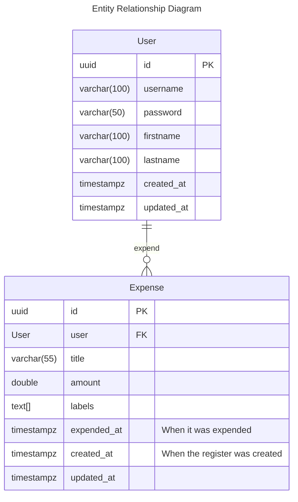

# Expense Tracking API

Project done following the premisses described in [this](https://roadmap.sh/projects/expense-tracker-api) exercise.

## Specs

- Kotlin 2.22 (Java 21) 
- Spring Boot 4.0.3
- Gradle 

## Data Model

**Entities**:
- User: An Expense API User
- Expense: Register of an amount expended/received by a user.

## TODOS

- [ ] Add db conn
- [ ] Add docker-compose
- [ ] Proper repository
- [ ] Hibernate and JPA
- [ ] Proper http controller error handling
- [ ] Authentication and Authorization

