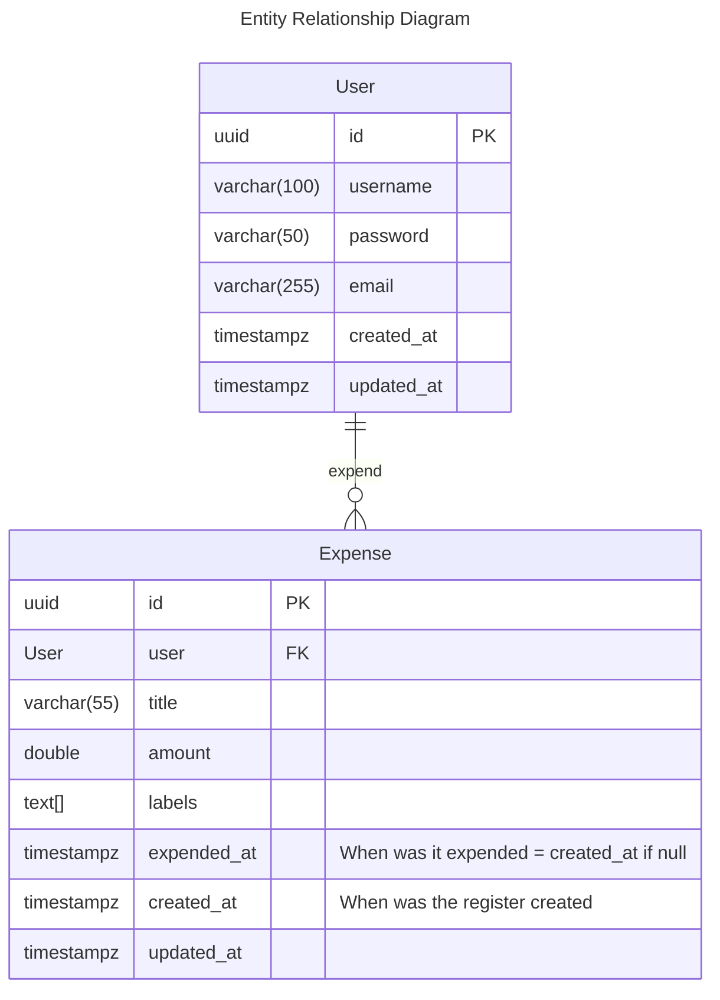

# Expense Tracking API

Project done following the premisses described in [this](https://roadmap.sh/projects/expense-tracker-api) exercise.

## TODOS

- [x] Add db conn
- [x] Proper repository
- [ ] Fix date and time types to be more consistent and use only the ISO 8601 UTC format across project 
- [ ] CRUD
- [ ] Hibernate and JPA
- [ ] Proper http controller error handling
- [ ] Add docker-compose
- [ ] Authentication and Authorization


## Specs

- Kotlin 2.22 (Java 21) 
- Spring Boot 4.0.3
- Gradle 

## Data Model

**Entities**:
- User: An Expense API User
- Expense: Register of an amount expended/received by a user.



## Expenses API

Here is the overall high level design of the API. Detailed info consult the OPEN API docs.

### Creating a expense

An authenticated user (a client invoking the API with the JWT Token) can create a new expense
by making a POST HTTP request to the /v1/expenses resource.

```bash
curl -X POST http://localhost:8080/v1/expenses \
  -H "Authorization: Bearer <JWT_TOKEN>" \
  -H "Content-Type: application/json" \
  -d '{
    "title": "string",
    "amount": 0.0,
    "labels": [],
    "expended_at": "ISO formatted Zoned Timestamp",
    }'
```

A successful response will be a HTTP Status 201 (Created) with a `Content-Type: application/json` body and a 
header location pointing towards the correct expense details:

Example:

```bash
< HTTP/1.1 201
< Location: http://localhost:8080/v1/expenses/123456789
< Content-Type: application/json; charset=UTF-8
{
  "id": "123456789"
}
```

### Getting a single expense detail

An authenticated user (a client invoking the API with the JWT Token) can get the details of a single expense
by making a GET HTTP request to the /v1/expenses resource with the required expense id as path parameter:

```bash
curl  http://localhost:8080/v1/expenses/123456789 \
  -H "Authorization: Bearer <JWT_TOKEN>"
```

A successful response is an HTTP Status 200 with a single JSON object on its root:

```json
{
    "id": "123456789",
    "title": "my expense",
    "amount": 150.00,
    "expendedAt": "2026-03-10",
    "createdAt": "2026-03-10",
    "updatedAt": null
}
```

### Listing past expenses

An authenticated user (a client invoking the API with the JWT Token) can list his/her past expenses
by making a GET HTTP request to the /v1/expenses resource.

```bash
curl  http://localhost:8080/v1/expenses \
  -H "Authorization: Bearer <JWT_TOKEN>"
```

The user will be able to also filter the expenses by expended date:

**Listing past week only**

```bash
curl  http://localhost:8080/v1/expenses?expendedAt=PAST_WEEK \
  -H "Authorization: Bearer <JWT_TOKEN>"
```

**Listing past month only**

```bash
curl  http://localhost:8080/v1/expenses?expendedAt=PAST_MONTH \
  -H "Authorization: Bearer <JWT_TOKEN>"
```

**Listing past 3 month only**

```bash
curl  http://localhost:8080/v1/expenses?expendedAt=PAST_3_MONTH \
  -H "Authorization: Bearer <JWT_TOKEN>"
```

**Listing custom**

Allow filtering by custom dates using the UTC [ISO8601](https://en.wikipedia.org/wiki/ISO_8601) Format:

- `%Y-%m-%d`

With hours:

- `%Y-%m-%dT%H:%M:%sZ`

Use a range like format to specify: `from_to`

Example: From **2026-03-10** to **2026-03-12**

```bash
curl  http://localhost:8080/v1/expenses?expendedAt=2026-03-10_2026-03-12 
  -H "Authorization: Bearer <JWT_TOKEN>"
```

Example: From **2026-03-10** until **today**

```bash
curl  http://localhost:8080/v1/expenses?expendedAt=2026-03-10
  -H "Authorization: Bearer <JWT_TOKEN>"
```

Example: From **first register** until **2026-03-10**

```bash
curl  http://localhost:8080/v1/expenses?expendedAt=_2026-03-10
  -H "Authorization: Bearer <JWT_TOKEN>"
```

In any case, the success response will be a HTTP Status 200 response with a JSON structure containing both the
details of each expense that matches the filters and the total of items that matched the filters.

Example:

```bash
< HTTP/1.1 200
< Content-Type: application/json; charset=UTF-8
[
  "total": 2,
  "items": [
      {
        "id": "123456789",
        "title": "my expense",
        "amount": 150.00,
        "expendedAt": "2026-03-10",
        "createdAt": "2026-03-10",
        "updatedAt": null
      },
      {
        "id": "987654321",
        "title": "my expense 2",
        "amount": 1250.00,
        "expendedAt": "2026-02-15",
        "createdAt": "2026-03-01",
        "updatedAt": "2026-03-02"
      }
  ]
]
```

### Deleting Expenses

An authenticated user (a client invoking the API with the JWT Token) can delete his/her past expenses
by making a DELETE HTTP request to the /v1/expenses resource informing the expense ID as a PATH Param:

```bash
curl -X DELETE http://localhost:8080/v1/expenses/987654321
  -H "Authorization: Bearer <JWT_TOKEN>"
```

The delete resource is IDEMPOTENT and will always return a HTTP Status 204 don't matter if failed or not.

```bash
< HTTP/1.1 204 No Content
```

